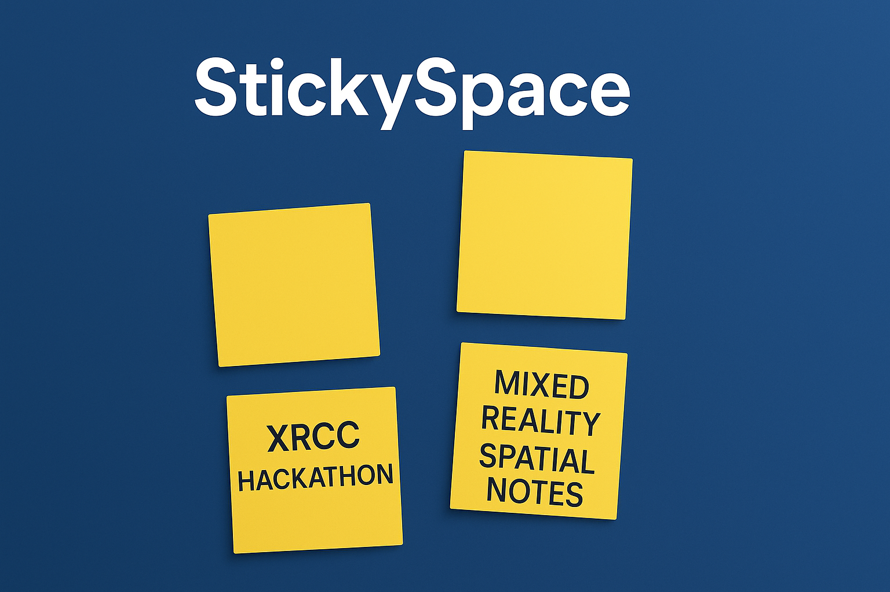

# StickySpace – Spatial Notes in Mixed Reality

StickySpace is an intuitive mixed-reality spatial notes application that lets users place virtual sticky notes directly onto walls, surfaces, and objects around them. Designed for productivity, brainstorming, and spatial organization, StickySpace transforms any environment into an interactive canvas for ideas.

## Features & Functionality

### **Place Notes Anywhere**
Point at any wall or surface and press the **A button** to place a new sticky note at that location.

### **Add or Edit Content**
Press the **A button** again while targeting an existing note to open it and add or modify its content.

### **Delete Notes Easily**
Press the **B button** while pointing at a note to remove it from the environment.

---

StickySpace makes it effortless to anchor thoughts, reminders, and ideas in the real world, providing a seamless and immersive spatial note-taking experience.

## Gallery

### Thumbnail

### Screenshots
  
  
  

## Project Info

- **Demo Video:** https://youtu.be/2yoNOJR6SPI  
- **Created for:** *XRCC Hackathon 2025*  
- **Built With:** Unity (C#), Meta SDK  
- **Tested On:** Meta XR Simulator  
- **Development Style:** Rapid prototyping  
